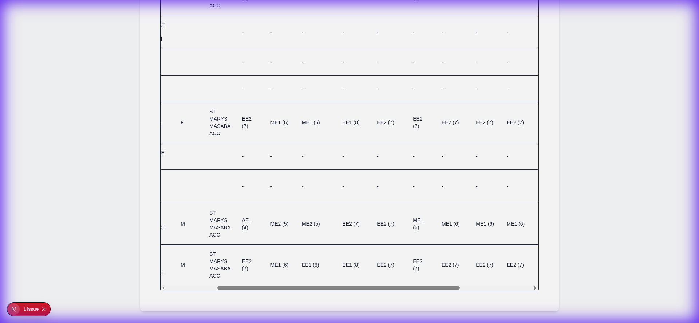
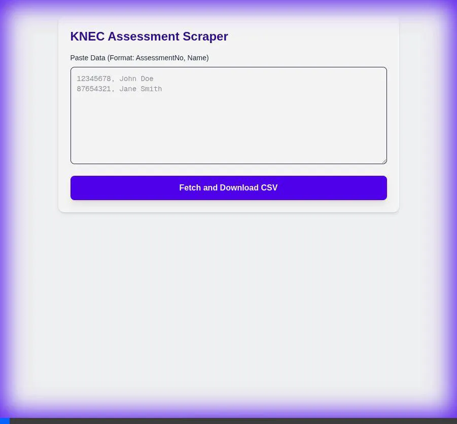

# KNEC Assessment Scraper

A professional, high-performance tool for scraping, analyzing, and reporting KNEC assessment results. Built with Next.js, Tailwind CSS, and shadcn/ui.



## Features

-   **Automated Data Retrieval**: Scrapes assessment data from the KNEC portal using a robust, retry-enabled API handler.
-   **Bulk Processing**: Supports bulk input of student data (Name & Assessment Number) with intelligent parsing.
-   **Interactive Results Table**:
    -   Sortable columns for easy analysis.
    -   Dedicated columns for Pathway scores (Arts & Sports, Social Science, STEM).
    -   Subject-specific grade and point display.
-   **Summary Dashboard**: Instant visualization of key metrics:
    -   Total Candidates
    -   Gender Distribution
    -   Average Pathway Scores
-   **Professional Reporting**:
    -   **Print to PDF**: Generates a clean, printer-friendly report with a single click.
    -   **CSV Export**: Downloads raw data for further analysis in Excel or Sheets.
-   **Modern UI/UX**:
    -   Clean, responsive design using **shadcn/ui**.
    -   Real-time processing logs.
    -   Polished interactions and typography.

## Demo

### Bulk Processing & Summary
Watch the system process a batch of 30 students and generate instant insights.


### Interactive Table & Sorting
Easily sort and analyze results by assessment number, name, or pathway scores.



## Tech Stack

-   **Framework**: [Next.js 15](https://nextjs.org/) (App Router)
-   **Styling**: [Tailwind CSS](https://tailwindcss.com/) & [shadcn/ui](https://ui.shadcn.com/)
-   **Table Logic**: [@tanstack/react-table](https://tanstack.com/table/v8)
-   **PDF Generation**: [react-to-print](https://github.com/gregnb/react-to-print)
-   **CSV Parsing**: [PapaParse](https://www.papaparse.com/)
-   **Icons**: [Lucide React](https://lucide.dev/)

## Getting Started

1.  **Clone the repository**:
    ```bash
    git clone https://github.com/yourusername/knec-scraper.git
    cd knec-scraper
    ```

2.  **Install dependencies**:
    ```bash
    npm install
    ```

3.  **Run the development server**:
    ```bash
    npm run dev
    ```

4.  **Open the app**:
    Navigate to [http://localhost:3000](http://localhost:3000) in your browser.

## Usage

1.  **Prepare Data**: Have your list of students ready. Supported formats:
    -   `AssessmentNumber, Name`
    -   `Name AssessmentNumber` (e.g., copied from Excel)
2.  **Paste & Fetch**: Paste the data into the input box and click **Fetch Results**.
3.  **Analyze**: View the summary cards and sort the table to find insights.
4.  **Export**:
    -   Click **Print Report** for a PDF version.
    -   Click **Download CSV** for the raw file.

## License

MIT
